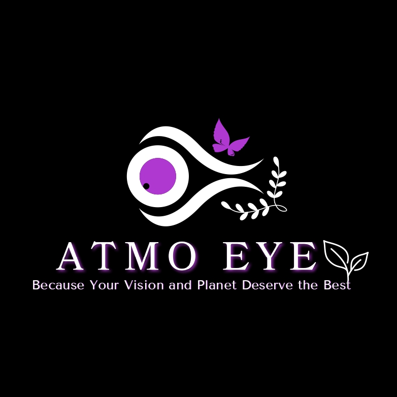

# AtmoEye
AtmoEye is an AI-driven application designed to provide users with a fast and efficient way to diagnose potential eye conditions using self-taken images.



## 🚀 Features
### AI-Powered Diagnosis
- Uses a trained machine learning model to detect uveitis, cataracts, and other eye conditions
### File Upload and Camera Integration
- Allows users to upload a photo or capture one directly using their device's camera
### **User-Friendly Interface**
- Clean, responsive design with a focus on accessibility and ease of use
### **Confidence Scoring**
- Displays confidence percentages for diagnosis accuracy

## 🛠️ Tech Stack


## 🖥️ How to Use
### Prerequisites
- Install Node.js
- Install Docker
### 1. Clone this Repository
 ```bash
  git clone https://github.com/your-username/retinova.git
  cd retinova
```
### 2. Install Dependecies
```bash
  cd frontend
  npm install
  cd ../backend
  npm install
  cd ../ml-model
  pip install -r requirements.txt
```
### 3. Run the AI Model
```bash
  fastapi run
```
### 4. Run the Backend
```bash
  cd backend
  node app.js
```
### 5. Run the Frontend
``` bash
  cd frontend
  npm run dev
```
### 6. Access the Application
Open http://localhost:3000 in your browser.

### 7. Using Docker (Optional)
```bash
  docker-compose up --build
```

## 📈 Future Enhancements
### Extended AI Capabalities
- Add support for detecting more eye conditions
- Improve the training dataset to enhance accuracy and minimize false positives
  
### Filtering Features
- Give enhanced clinical reccomendations based on insurance information
- Tailored reccomendations based on demographics (race, age, medical history, etc.)

  


